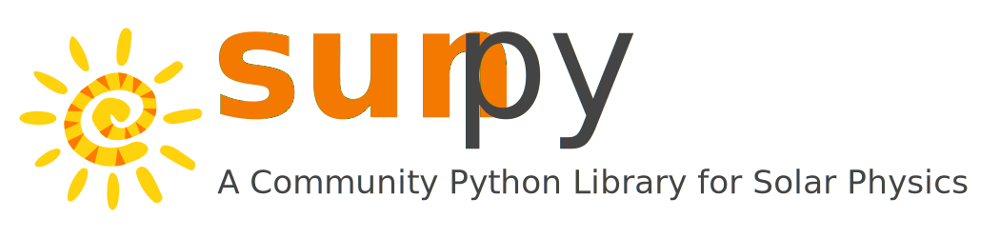

# **SunPy: Solar Data Processing with Python**

## SDO 2025 Science Workshop: A Gathering of the Helio-hive

Curious about what new scientific discoveries await once you have Conda and SunPy installed?
Often, the biggest barrier to adopting a new programming language is simply getting started.
This tutorial is designed to help you overcome that hurdle and integrate Python into your next project with confidence.
We'll guide you through accessing and downloading data from the Virtual Solar Observatory (VSO), creating advanced plots, and leveraging powerful data analysis tools included in Conda's packages.
By the end, you'll be equipped to analyze datasets with ease, and discover how similar interfaces within SunPy enable seamless comparisons and overlays across various data sets.

### *Micheal Kirk* (NASA GSFC) and *Nabil Freij* (SETI/LMSAL) *on behalf of the SunPy Community*

### *with many thanks to: Albert Shih, Laura Hayes, David Stansby, Stuart Mumford, Pey Lian Lim, Erik Tollerud, Larry Bradley, Tim Pickering, Tom Aldcroft, David Shupe and Brett M. Morris**
